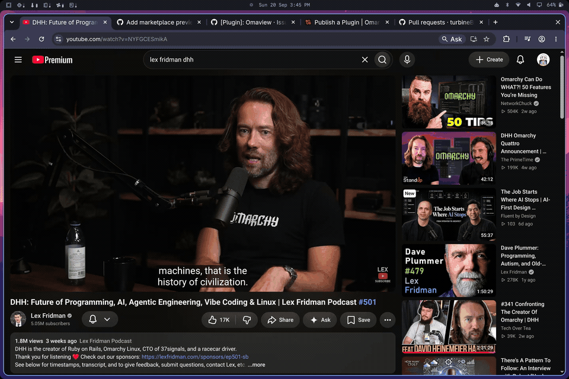

# Edge PiP

A picture-in-picture window that makes room when you need it. Edge PiP docks the
window to a screen edge. Hover over it and it slides aside, leaving a small tab
so you can reach what was underneath. Move away and it comes back.



## Install

Requires Omarchy with its Quickshell shell, Hyprland, and Python 3. Install it
with:

```bash
omarchy plugin add https://github.com/turbineBMW/PIP --enable
```

Omarchy's usual browser picture-in-picture rule tags these windows `pip`. For
another app, give its floating window that tag in your Hyprland config. No
packages or system settings are changed by the plugin installer.

## Use

The tab lets you drag the PiP to another edge, bring it back to use the
player's own controls, resize it, or close it. A play/pause button appears
when the player supports MPRIS. The last dock position and size are remembered.

You can also call the actions from a keybind or terminal:

```bash
omarchy-shell pip toggle
omarchy-shell pip peek
omarchy-shell pip resize
```

To adjust the behavior, add settings to the plugin entry in
`~/.config/omarchy/shell.json`:

```json
{
  "id": "turbinebmw.pip",
  "margin": 10,
  "hideDelay": 0,
  "showDelay": 120,
  "autoHide": true
}
```

`margin` is the edge gap in pixels; delays are milliseconds. Set `autoHide` to
`false` to keep the window docked without tucking it away. The optional
`pollInterval` setting controls pointer sampling and defaults to 33 ms.

## Remove

```bash
omarchy plugin remove turbinebmw.pip
```

A tucked PiP returns to its dock when the plugin unloads. The plugin's saved
position remains in `~/.local/state/omarchy/pip-dock.json`; you can delete it
later if you no longer want that preference. Edge PiP is released under the
[MIT license](LICENSE).
